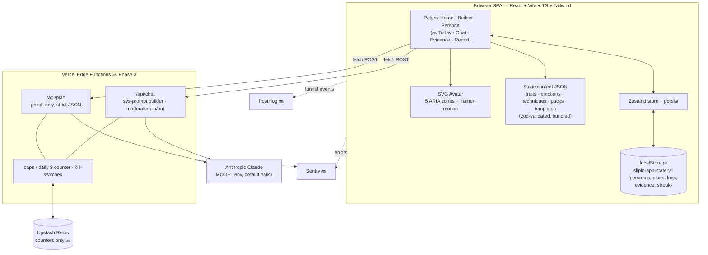

# Architecture — living doc, updated at the end of every phase

*Status: end of Phase 2. Sections marked 🔜 land in later phases.*

## 1. User-facing flows

**Create a persona** (the only flow live after Phase 1):
`Home (pick module) → Builder (pick pack OR free-hand) → click avatar zones → toggle curated traits / set emotion intensities (chest) → name + gesture → Save → Persona page`

- Traits are **curated-only** (safety rule): the builder offers checkboxes from `src/content/traits.json`, never free text. The only free text a user enters is the persona *name* (30-char cap).
- Gestures come from a curated dropdown; identity script comes from the pack or is auto-composed from chosen trait names.

**Returning visit:** Home shows a "Continue with your persona →" banner when personas exist; `/persona` re-renders the dressed avatar from localStorage.

**Daily loop** (`/today`, live after Phase 2):
`Morning intent (identity script + commit button) → Wear session (week's wear script + if-then armor) → 2 micro-missions (rotating daily from the week's 6) → Evening debrief (score 1–10 + win + slip) → streak++ · win auto-logged as evidence`

- The plan auto-generates from the template engine the first time `/today` opens — fully offline, no LLM.
- One focus trait per week (Franklin rotation), mission difficulty ramps: wk1 easy → wk4 hard.
- Streak = consecutive days with a debrief; a yesterday-ending streak survives until today is fully missed (`src/engine/streaks.ts`).

🔜 Phase 3: persona chat + plan polish. 🔜 Phase 4: evidence log UI, 30-day report, share card.

## 2. Component wiring

```
src/main.tsx            document.title = APP_NAME · BrowserRouter · mounts App
src/App.tsx             header (APP_NAME) · routes · persistent DisclaimerFooter
  /            → pages/Home.tsx          module grid (content MODULES)
  /build/:mod  → pages/Builder.tsx       pack picker → zone editor (Avatar + trait toggles + emotion sliders)
  /persona     → pages/PersonaPage.tsx   dressed avatar + chips + identity script
  /today       → pages/Today.tsx         4-step daily loop; auto-builds plan if missing
  /crisis      → pages/Crisis.tsx        crisis resources (footer links here)

engine/planEngine.ts    buildPlan(persona) — deterministic (PRNG seeded from persona.id):
                        4 weeks from template.weekStructure · focus trait rotates ·
                        6 missions/week ranked by (difficulty ramp, focus-category match) ·
                        if-thens from trait templates · wear script w/ placeholders filled.
                        currentWeek/todaysMissions derive everything from plan.createdAt.
engine/streaks.ts       computeStreak(logs) — consecutive debrief days

components/avatar/Avatar.tsx   inline SVG silhouette; ZONES const = 5 hit-targets
                               (head/mouth/chest/hands/feet), each a focusable
                               role=button ellipse w/ ARIA labels, count badge,
                               framer-motion glow; chest aura scales w/ emotion energy;
                               honors prefers-reduced-motion
```

## 3. Data: where everything lives

| Data | Location | Notes |
|---|---|---|
| Content library (traits, emotions, techniques, packs, plan templates) | `src/content/*.json`, bundled into the JS at build time | zod-validated + referential-integrity-checked at module load (`src/content/index.ts`) — bad content fails loudly in dev |
| User state (personas, plans, logs, evidence, streak) | localStorage key `slipin-app-state-v1`, single JSON blob | Zustand + persist (`src/store/appStore.ts`), version field for future migrations |
| Module metadata (names, taglines) | `MODULES` in `src/content/index.ts` | |
| Display name | `APP_NAME` in `src/config/app.ts` — the ONLY place | storage key is deliberately not derived from it |
| Chat transcripts | 🔜 nowhere server-side; session-only in browser | PRD §9 privacy |

Store shape = `AppState` in `src/types.ts` (mirrors PRD §7). Selectors: `useActivePersona`, `usePlanFor`, `useTodayLog`.

## 4. Backend wiring 🔜 (Phase 3 — designed, not yet built)

Two Vercel Edge Functions, nothing else:
- `POST /api/chat` — body: persona JSON + message history. Builds rehearsal-mirror system prompt at request time; keyword pre-filter + Haiku moderation on input and output; 20 msgs/day/persona.
- `POST /api/plan` — body: deterministic template plan + persona. Haiku rewrites wording only, strict JSON out; parse failure → template text kept; 3/day.
- Shared middleware: per-IP rate cap + daily cost counter (Upstash Redis, counters only — no user data; absent → best-effort in-memory), `CHAT_ENABLED`/`POLISH_ENABLED` kill-switches, `DAILY_BUDGET_USD` hard stop, Sentry.

## 5. Fail-safe behavior

| Failure | Behavior |
|---|---|
| Offline / LLM down | App fully usable: builder, plans (template text), daily loop. Chat shows disabled notice 🔜 |
| Budget hit / kill-switch off | Edge fn returns 503 + reason → UI shows "try later" 🔜 |
| Moderation block | Generic redirect message, `moderation_blocked` event 🔜 |
| localStorage corrupt/full | Export offer + safe reset 🔜 Phase 4 |
| Invalid content JSON | Throws at startup (dev-time catch, content is version-controlled) |

## 6. System diagram


