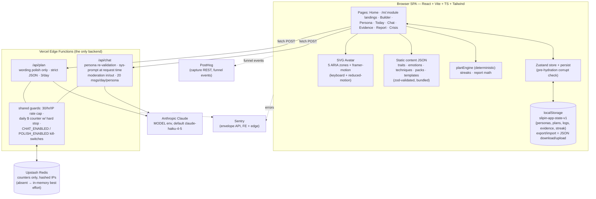

# Architecture — living doc, updated at the end of every phase

*Status: MVP complete (end of Phase 5). All P0 features live; deploy = Vercel import + env vars (README).*

## 1. User-facing flows

**Create a persona** (the only flow live after Phase 1):
`Home (pick module) → Builder (pick pack OR free-hand) → click avatar zones → toggle curated traits / set emotion intensities (chest) → name + gesture → Save → Persona page`

- Traits are **curated-only** (safety rule): the builder offers checkboxes from `src/content/traits.json`, never free text. The only free text a user enters is the persona *name* (30-char cap).
- Gestures come from a curated dropdown; identity script comes from the pack or is auto-composed from chosen trait names.

**Returning visit:** Home shows a "Continue with your persona →" banner when personas exist; `/persona` re-renders the dressed avatar from localStorage.

**Daily loop** (`/today`, live after Phase 2):
`Morning intent (identity script + commit button) → Wear session (week's wear script + if-then armor) → 2 micro-missions (rotating daily from the week's 6) → Evening debrief (score 1–10 + win + slip) → streak++ · win auto-logged as evidence`

- The plan auto-generates from the template engine the first time `/today` opens — fully offline, no LLM.
- One focus trait per week (Franklin rotation), mission difficulty ramps: wk1 easy → wk4 hard.
- Streak = consecutive days with a debrief; a yesterday-ending streak survives until today is fully missed (`src/engine/streaks.ts`).

**Persona chat** (`/chat`): session-only rehearsal-mirror conversation, 20 msgs/day/persona, moderation both directions — blocked topics get an in-character redirect (harm → crisis page pointer).

**Evidence & report**: debrief wins auto-log as evidence; `/evidence` adds manual evidence-hunt entries + 14-day activity dots; `/report` shows then-vs-now scores, trend bars, proof highlights, PNG share card, and JSON export/import.

**Acquisition landings**: `/m/actor`, `/m/student`, `/m/self-transform`, `/m/emotional`, `/m/animal`, `/m/physical`, `/m/manifestation`, `/m/freehand` — per-niche copy, one CTA into the builder.

## 2. Component wiring

```
src/main.tsx            document.title = APP_NAME · BrowserRouter · mounts App
src/App.tsx             header (APP_NAME) · routes · persistent DisclaimerFooter
  /            → pages/Home.tsx          module grid (content MODULES)
  /build/:mod  → pages/Builder.tsx       pack picker → zone editor (Avatar + trait toggles + emotion sliders)
  /persona     → pages/PersonaPage.tsx   dressed avatar + chips + identity script
  /today       → pages/Today.tsx         4-step daily loop; auto-builds plan if missing; ✨ polish button
  /chat        → pages/Chat.tsx          session-only persona chat (nothing persisted)
  /evidence    → pages/Evidence.tsx      proof timeline + evidence-hunt input + 14-day dots
  /report      → pages/Report.tsx        then-vs-now stats, score bars, share card, export/import
  /crisis      → pages/Crisis.tsx        crisis resources (footer links here)

lib/analytics.ts   PostHog capture REST (no SDK); no-op without VITE_POSTHOG_KEY.
                   Events: persona_created, plan_generated, plan_polished, wear_session_done,
                   mission_done, debrief_done, chat_msg, moderation_blocked, llm_error,
                   report_viewed, card_shared
lib/sentry.ts      window.onerror + unhandledrejection → Sentry envelope API; no-op without DSN
lib/recovery.ts    pre-hydration corrupt-blob check (main.tsx loads App dynamically AFTER it);
                   corrupt blob moved to `slipin-app-state-v1-corrupt`, banner offers download
lib/exportImport.ts  full-state JSON download/upload (anonymous continuity)
lib/cardExport.ts    1080×1350 PNG share card drawn on canvas (no DOM-capture dep)

engine/planEngine.ts    buildPlan(persona) — deterministic (PRNG seeded from persona.id):
                        4 weeks from template.weekStructure · focus trait rotates ·
                        6 missions/week ranked by (difficulty ramp, focus-category match) ·
                        if-thens from trait templates · wear script w/ placeholders filled.
                        currentWeek/todaysMissions derive everything from plan.createdAt.
engine/streaks.ts       computeStreak(logs) — consecutive debrief days

components/avatar/Avatar.tsx   inline SVG silhouette; ZONES const = 5 hit-targets
                               (head/mouth/chest/hands/feet), each a focusable
                               role=button ellipse w/ ARIA labels, count badge,
                               framer-motion glow; chest aura scales w/ emotion energy;
                               honors prefers-reduced-motion
```

## 3. Data: where everything lives

| Data | Location | Notes |
|---|---|---|
| Content library (traits, emotions, techniques, packs, plan templates) | `src/content/*.json`, bundled into the JS at build time | zod-validated + referential-integrity-checked at module load (`src/content/index.ts`) — bad content fails loudly in dev |
| User state (personas, plans, logs, evidence, streak) | localStorage key `slipin-app-state-v1`, single JSON blob | Zustand + persist (`src/store/appStore.ts`), version field for future migrations |
| Module metadata (names, taglines) | `MODULES` in `src/content/index.ts` | |
| Display name | `APP_NAME` in `src/config/app.ts` — the ONLY place | storage key is deliberately not derived from it |
| Chat transcripts | 🔜 nowhere server-side; session-only in browser | PRD §9 privacy |

Store shape = `AppState` in `src/types.ts` (mirrors PRD §7). Selectors: `useActivePersona`, `usePlanFor`, `useTodayLog`.

## 4. Backend wiring (live — two Vercel Edge Functions, nothing else)

```
api/chat.ts   POST {persona, messages[≤12]} — guard order:
              kill-switch → key present → rate cap → budget → persona validation
              → 20/day/persona cap → moderation IN → Claude (system prompt built
              per-request, max_tokens 200) → record spend → moderation OUT → {reply, remaining}
api/plan.ts   POST {persona, weeks} — same guards (polish cap 3/day) → Claude
              rewrites wording ONLY, strict JSON → parse + shape check (week count,
              mission ids, lengths must match exactly) → mismatch = 502, client keeps template
api/_lib/     anthropic.ts (Messages API over raw fetch — NO SDK: the official
              SDK imports node:fs/node:path which the Edge runtime can't bundle) ·
              env.ts (kill-switches, MODEL, pricing) · counters.ts (Upstash REST
              w/ in-memory fallback; IPs stored only as FNV hash) · guards.ts
              (rate 30/hr/IP · chat 20/day/persona · polish 3/day · budget in
              micro-$ w/ hard stop) · moderation.ts (regex pre-filter for
              romantic/clinical/harm + Haiku classifier in&out, fails open on
              infra errors only) · persona.ts (server-side re-validation against
              the bundled curated library — uncurated traits are rejected;
              rehearsal-mirror system prompt per PRD §8) · sentry.ts (envelope
              API via fetch, no-op without DSN)
```

Key server-trust decision: the browser's persona JSON is **re-validated against the curated content library bundled into the function** — a tampered request with invented traits gets a 400. Moderation blocks return HTTP 200 with `{blocked, category, reply}` where `reply` is an in-character redirect (harm category points to the crisis page). Blocked messages still count against the daily cap.

Client (`src/lib/api.ts`): all LLM calls go through these two endpoints only. Non-JSON responses and network failures are typed as `offline`; every error becomes a friendly inline notice (chat input is preserved on failure; plan polish failure leaves the template plan untouched).

## 5. Fail-safe behavior

| Failure | Behavior |
|---|---|
| Offline / LLM down | App fully usable: builder, template plans, daily loop. Chat/polish show inline notice; chat input preserved |
| Anthropic 4xx/5xx mid-request | 502 `llm_error`, friendly message, error → Sentry; plan keeps template text |
| Budget hit | 503 `budget_exhausted` — "try again tomorrow" notice |
| Kill-switch off (`CHAT_ENABLED`/`POLISH_ENABLED`=false) | 503 `chat_disabled`/`polish_disabled` notice |
| Rate/msg caps | 429 with human message; chat shows remaining-messages counter |
| Moderation block | HTTP 200, in-character redirect reply (harm → crisis pointer), still counts against cap; `moderation_blocked` event fired |
| Upstash not configured | Best-effort per-isolate in-memory counters (dev-friendly; noted in README) |
| Moderation classifier infra error | Fails open — keyword filter + system-prompt guardrails still apply |
| localStorage corrupt | Pre-hydration check moves the blob to a backup key, app boots fresh, banner offers backup download |
| Invalid content JSON | Throws at startup (dev-time catch, content is version-controlled) |

## 6. System diagram


